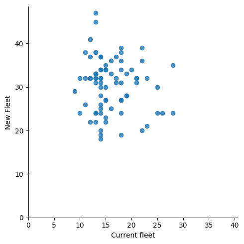

# Lab 2 

## Vehicles Plotting Results 

>the new fleet vs old fleet

>the old fleet vs index

>the new fleet vs index

>the histogram of the old fleet 

>the histogram of the new fleet 

## Bootstrap Plotting Results

>the bootstrap of the customers with differnt number of iterations 

>the bootstrap of the new fleet with differnt number of iterations 

 

>the bootstrap of the new fleet with differnt number of iterations 

